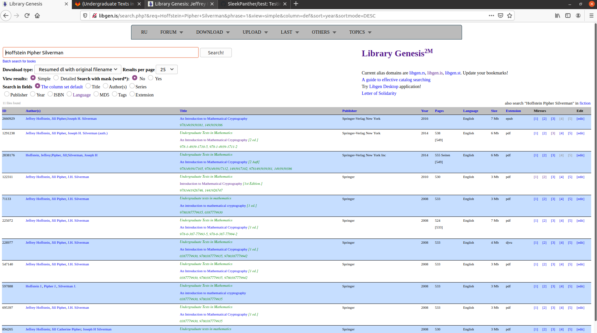
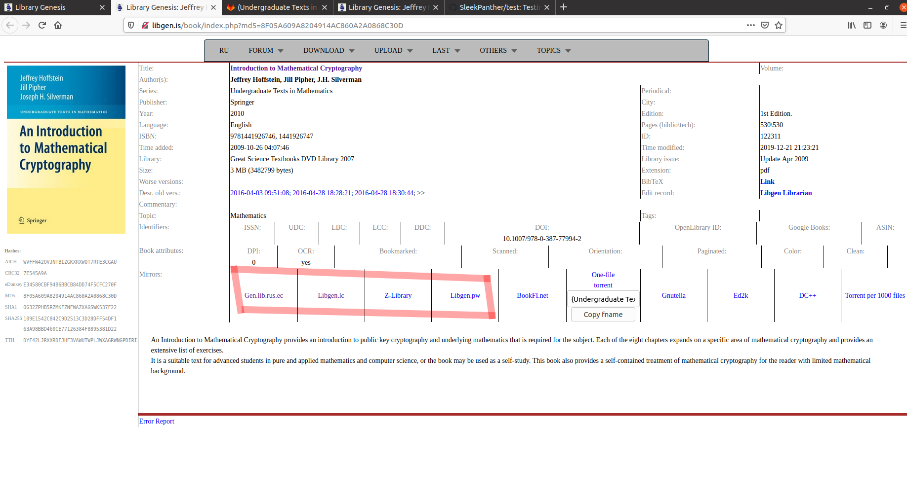
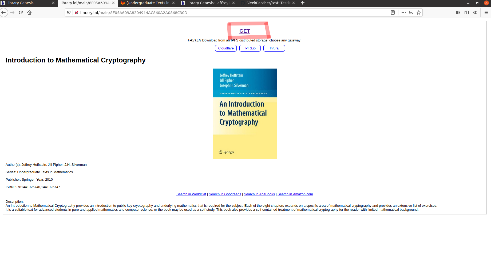
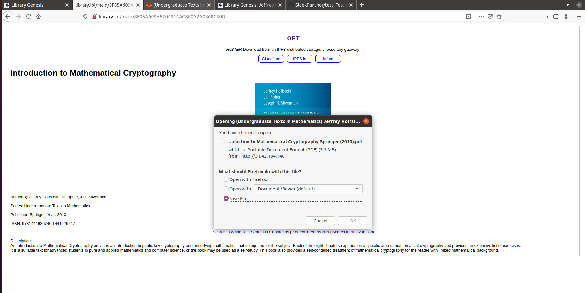

# Libgen-Tutorial

Simple tutorial on how to download from http://libgen.is/ for novice alike

## Search your desired books (obviously...) and select which version you want to download. 

As an example, let's try to download An Introduction to Mathematical Cryptography by Hoffstein Pipher Silverman 'and let's choose the 2010 version

## Choose the download service

Once you complete step one, the page should look like this. There are multiple download service provided by the website, but I would recommend using either of the 4 marked in pink. As an example, let's try using Gen.lib.rus.ec

## Click GET

## Save File to your PC

Done!
